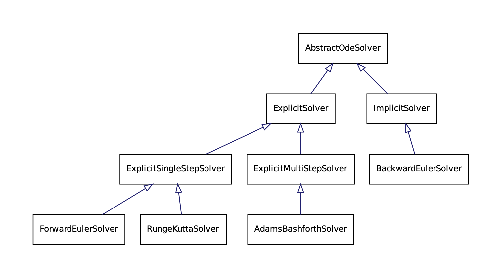

# Solvers for Ordinary Differential Equations
Project for MATH-458 Programming concepts in scientific computing (EPFL, 2024).
## Team members
- Ezra Baup, estelle.baup@epfl.ch
- Siyuan Cheng, siyuan.cheng@epfl.ch

## Table of contents
- [Project Overview](#project-overview)
- [How to](#how-to)
- [Features](#features)
- [Limitations](#limitations)

## Project Overview
This project provides an implementation of numerical solvers for solving ordinary differential equations (ODEs), 
i.e. $y^{'}(t)=f(t,y(t))$. The solvers currently support the following methods:

- **Forward Euler (FE)**: Explicit single-step solver.
- **Runge-Kutta (RK)**: Explicit single-step solver supporting orders 1 through 4.
- **Adams-Bashforth (AB)**: Explict multistep solver with configurable order and initialization method (e.g., RK4, Forward Euler).
- **Backward Euler (BE)**: Implicit single-step solver with optional tolerance and iteration settings.

The default implementation solves the model problem $y^{'} = -0.3y$ using a 4th-order Runge-Kutta method. 
The project is modular, allowing customization of solvers, functions, and configurations.
### Right-Hand Side (RHS) Functions
To represent the right-hand side function $f(t, y)$ in the ODE, the project provides the following built-in options:

1. **Model Problem (`model`)**:
    - Describes a simple exponential decay problem $f(t, y) = -k \cdot y$.
    - Requires a positive decay constant `decay = k`.
    - Given the initial condition $y(t) = y_0$, the analytical solution is $y(t) = y_0 e^{-k(t-t_0)}.$

2. **Polynomial Function (`poly`)**:
    - Describes a polynomial of the form $f(t, y) = a_0 + a_1 y + a_2 y^2 + \dots + a_n y^n$.
    - Requires a list of coefficients `[a_0, a_1, ..., a_n]`.

These RHS functions can be selected and configured in the configuration file (`config/config.json`), 
providing flexibility for different types of ODEs. 
You can also implement custom RHS functions by modifying 
the `ExampleRHS` classes.

## Structure
The main structure of the project is as follows:
- `/config`: configuration settings to run the main.
- `/include`: contains all header files.
- `/src`: contains all implementation files.
- `/test`: contains test files, supported by googletest.

[//]: # (The detailed structure of the project is shown below.)
```
    pcsc-project/
    ├── config/
    │   └── config.json                               // Configuration settings
    ├── include/
    │   ├── AbstractOdeSolver.h                       // Base class for all solvers
    │   ├── AdamsBashforthSolver.h                    
    │   ├── BackwardEulerSolver.h                    
    │   ├── ButcherTableau.h                          // For Runge-Kutta
    │   ├── ConfigParser.h                           
    │   ├── ExampleRHS.h                              
    │   ├── ExplicitMultiStepSolver.h                 // Extends ExplicitSolver to multi-step
    │   ├── ExplicitSingleStepSolver.h                // Extends ExplicitSolver to single-step
    │   ├── EXplicitSolver.h                          // Base class for all explicit solvers
    │   ├── ForwardEulerSolver.h                    
    │   ├── ImplicitSolver.h                          // Base class for implicit solvers
    │   ├── json.hpp                      
    │   ├── KnownDerivativeRHS.h                      // RHS with analytically known derivative
    │   ├── ModelProblemRHS.h
    │   ├── ODERightHandSide.h                        // Base class for RHS functions
    │   ├── PolynomialRHS.h
    │   ├── RungeKuttaSolver.h                       
    │   ├── SolverFactory.h                           
    │   └── UnknownDerivativeRHS.h                    // RHS with unknown derivative 
    ├── src/
    │   └── [Corresponding .cc files implementing the headers]
    ├── test/
    │   └── [Test files using googletest]
    ├── .gitignore
    ├── .gitmodules
    ├── main.cc     
    ├── CMakeLists.txt                                
    └── README.md                          
```
Here is a brief sketch of the class hierarchy.



## How to
### Quick Start
First, you need to clone the project repository on your local machine.
```
git clone git@gitlab.epfl.ch:ebaup/pcsc-project.git
cd pcsc-project
```
### Set-up and Building
The project relies on *googletest* and *Eigen*, initialize them as submodules to install these dependencies:

```
git submodule update --init 
```

You can build and run the project using your preferred IDE (e.g., CLion) or the terminal. Below are the steps for the terminal:

```
mkdir build
cd build
cmake ..
make
./main
```

[//]: # (After these lines, executable files are produced. Simply run 'main' on your IDE, )

[//]: # (or run the following lines on your terminal:)

[//]: # ()
[//]: # (```)

[//]: # (cd .. // or simply open your terminal in the root project folder)

[//]: # (./main)

[//]: # (```)

[//]: # (TODO complete instructions if needed, typical execution)
###  Update the Configuration
Modify the `config/config.json` file to set global parameters and solver-specific options. 
```
{
  "global": {
    "stepSize": The time step for the solver, e.g., 0.01,
    "t0": Start time of the simulation, e.g., 0.0,
    "t1": End time of the simulation, e.g., 1.0,
    "initialValue": Initial guess y_0, e.g., 1.0
  },
  "solver": {
    "method": Solver type, choose from {"RK", "AB", "BE", "FE"},
    "parameters": {
      "order": For Runge Kutta, choose from {1, 2, 4},
      "steps": For AdamsBashforth, choose from {1, 2, 3, 4},
      "initMethod": For AdamsBashforth, choose from {"RK4", "FE"},
      "tolerance": For Newton method in Backward Euler, default 1e-6,
      "maxIter": For Newton method in Backward Euler, default 50
    }
  },
  "rhs": {
    "type": RHS type, choose from {"model", "poly"},
    "parameters": {
      "decay": Decay constant for model problem, e.g., 0.1,
      "coefficients": For polynomials, a list of coefficients [a_0, a_1, ..., a_n]
    }
  }
}
```
**Note:** It will automatically build the forward Euler method when choosing `order = 1` for Runge Kutta
or `steps = 1` for AdamsBashforth, as they are the same solvers.


[//]: # (TODO logic)


## Limitations

We encountered various challenges during the realisation of this project, some were taken care of, and some remain as limitations of our implementation.

### Solvers classes
Our first main challenge was to find a suitable class organisation for the different solvers. 

A good knowledge of the methods was needed to understand how they relate with each other, and what were their common and specific characteristics.
There are different approaches we thought about, and we decided to split the methods between two main categories: **explicit** and **implicit**.
The explicit methods can be single-step or multi-step methods. 

Another approach we thought about was to separate in two other categories: Runge-Kutta and linear multi-step methods.
Then linear multi-step methods could have been split between explicit and implicit and would have been determined by their weights.

### Function class
Our second main challenge was to create a function class, and handle the derivatives. 
We decided to create a base class (`ODERighHandSide`) and two children that correspond to functions for which we know the derivative and for which we do not.
If the derivative is not known, it is approximated with centered differences.

[//]: # (TODO function file)

There are however a few limitations with our approach. First, we can only use the functions that are in the file `ExampleRHS.h`.
An improvement would be to have a parser that lets the user write their function. 
The user would also need to specify if they want to use the known derivative for the function. This could be done either by letting the user specify the derivative, or by having a derivative calculator accessible in the project.


### Dimension of the ODE
The main limitation of our project is that it focuses strictly on ODEs that are from $\mathbb{R} \times \mathbb{R}$ to $\mathbb{R}$, i.e. $y,t$ are real and so is $f(t,y)$.
Possible extensions could be 
- allowing $y$ to be a vector, i.e. $y \in \mathbb{R}^n$
- allowing $f$ to be a vector-valued function, i.e. solve a system of ODEs
- allowing $y$ to be a complex number, or a complex-valued vector, etc.

For this a few solutions we thought about were to use template classes and/or Eigen vectors for $y$.
